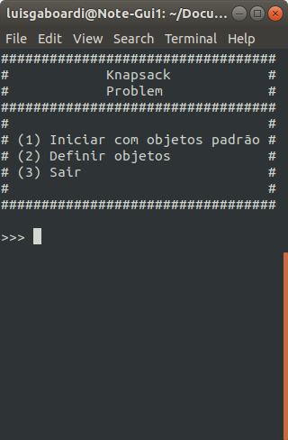

# Knapsack Problem

**Número da Lista**: 3 
**Conteúdo da Disciplina**: Greed 

## Alunos
|Matrícula | Aluno |
| -- | -- |
| 18/0022962  |  Luís Guilherme Gaboardi Lins |

## Sobre
   
O Knapsack Problem se dá por: dada uma lista de objetos, cada um com um peso e com um valor, devemos selecionar a quantidade de cada objeto a fim de que o peso total não ultrapasse um limite pré-definido e, ao mesmo tempo, tenha o maior valor possível.

## Screenshots
   
   
   

## Pré-Requisitos
Compilador GCC, ambiente capaz de executar arquivos .c

## Instalação 
**Linguagem**: C 

### Linux

No terminal, escolha o local no qual a pasta será instalada e execute:

1. `git clone https://github.com/projeto-de-algoritmos/Greed_Knapsack-Problem.git`
2. `cd Greed_Knapsack-Problem`

Ou

1. Faça o download do projeto zipado a partir do GitHub
2. Descompacte a pasta no destino _path_ escolhido
3. Utilizado o terminal, acesse o local onde a pasta foi descompactada
4. `cd path/Greed_Knapsack-Problem`

Para executar:

1. `gcc knapsack.c -o prog`
2. `./prog`

## Uso
Explique como usar seu projeto caso haja algum passo a passo após o comando de execução.

### Vídeo Explicativo

